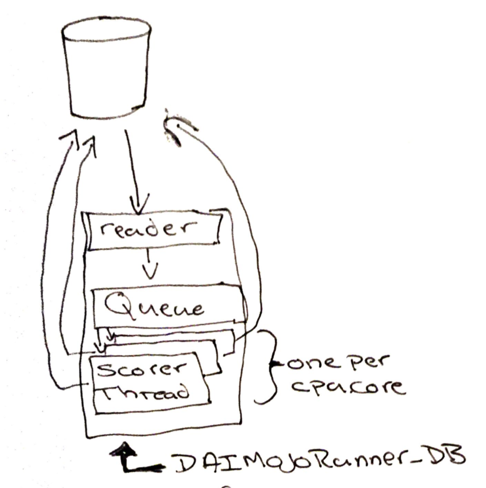

# DriverlessAI Mojo 
Some customers need to select rows from a Database, score and write back the predictions.

Before using DAI, they would convert a model to SQL and execute it, the time to write the SQL was long.

Using DAI and then this program enables them to quickly build and use models. 

## Distribution
Both the compiled distribution and source are available.

Available 'as-is' in [Distribution](Distribution)

See the source directory for the code [Source](Source). 

## Execution
The execution is simple: 

java -cp /PostgresData/postgresql-42.2.5.jar:dist/DAIMojoRunner_DB.jar daimojorunner_db.DAIMojoRunner_DB

This is a generic JDBC approach, that allows any JDBC type 4 driver to be specified on the java classpath. The DAIMojoRunner_DB.properties file then defines what driver to use.

You must have a DAI license to score, add the license in one of the standard ways, as a parameter, as a environment vailable for example:

 -Dai.h2o.mojos.runtime.license.file=/Driverless-AI/license/license.sig 
 
## Configuration

- Support encrypted password
	
	Store the encrypted password in the DAIMojoRunner_DB.properties
	
	Encrypt the password from Linux command line: (type in the password):
	
	echo h2oh2o | base64 -i –
	
	Encrypt the password from Windows PowerShell (password passed as h2oh2o)
[convert]::toBASe64String([Text.Encoding]::UTF8.GetBytes("h2oh2o"))

	Save the encrypted string to the SQLPassword parameter

- Prompting for password  
	Set SQLPrompt= Enables prompting for the password in the DAIMojoRunner_DB.properties
	
	Add the username to the SQLUser line make sure SQLPassword, is set SQLPassword=
Set SQLPrompt=true

-	Support returning the single or multiple class predictions.  
SQLKey is the DB key to use on the update statement
If SQLPrediction= then the returned model class names are used and have to match the DB schema. 

 For example if the target variable is Model_Prediction and it’s a binomial classification the model returns Model_Prediction.0 and Model_Prediction.1 these two columns would need to exist in the DB.
 
 If SQLPrediction=string then that is the name of the column the Model_Prediction will be updated.
 
- Handles nulls in the columns
Automatic detection

- Logging option
To track the execution, add -Dlogging=true to the java command line, this will write the original “row : target prediction” as it runs.

## Parameters
ModelName=pipeline.mojo  
SQLConnectionString= jdbc:sqlserver://<server>:<port>;databaseName=<dbname>;user=<user>;password=<password>  
SQLUser=  
SQLPassword=  
SQLKey=<row key for update>  
SQLPrediction=<column name to store prediction>  
SQLSelect=select statement    
SQLWrite=update <tablename> set <SQLPrediction>= where <SQLKey>=  

### Example
ModelName=pipeline.mojo  
SQLConnectionString=jdbc:postgresql://192.168.1.171:5432/LendingClub 
SQLUser=postgres  
SQLPassword=aDJvaDJvCg==  
SQLPrompt=  
SQLKey=id  
SQLPrediction=  
SQLSelect=select id, loan_amnt,  term,  int_rate,  installment,  emp_length,  home_ownership,  annual_inc,  verification_status,  addr_state,  dti,  delinq_2yrs,  inq_last_6mths,  pub_rec,  revol_bal,  revol_util,  total_acc  from "import".loanstats4  
SQLWrite=update "import".loanstats4 set where id=

 The above will score using pipeline.mojo and use the key 'id' to update the column name from the mojo into the table, to bad_loan.0 and bad_loan.1 must be in the table schema.
 
 If SQLPrediction was set to ModelPrediction (for example) then bad_loan.0 would be written to the table column ModelPrediction.
 
## Performance
 The driver starts a thread pre core, but you can override this with the -Dthreads= option and -Dcapacity= is the queue size.
 
 On a MacBook to a remote DB, I have seen it achieve 814TPS when setting the threads to 4x the cores and the capacity to 2x the threads setting.
 
## Testing
This has been used with a Postgres DB and Microsoft SQL Server 12 

## Questions
Feel free to email me and I will try to help <egudgion@h2o.ai>
	
