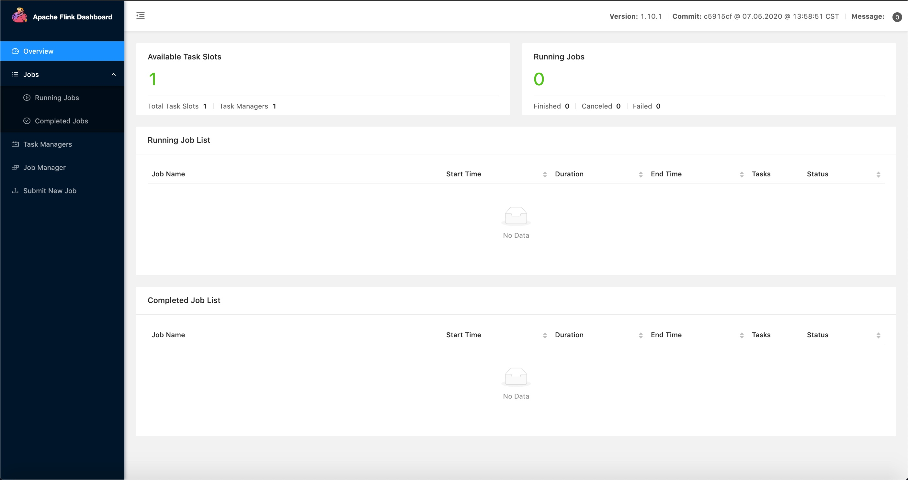
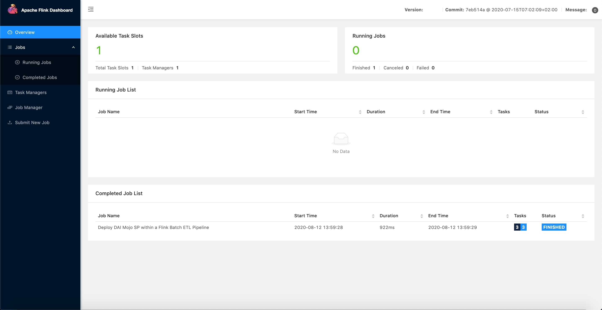
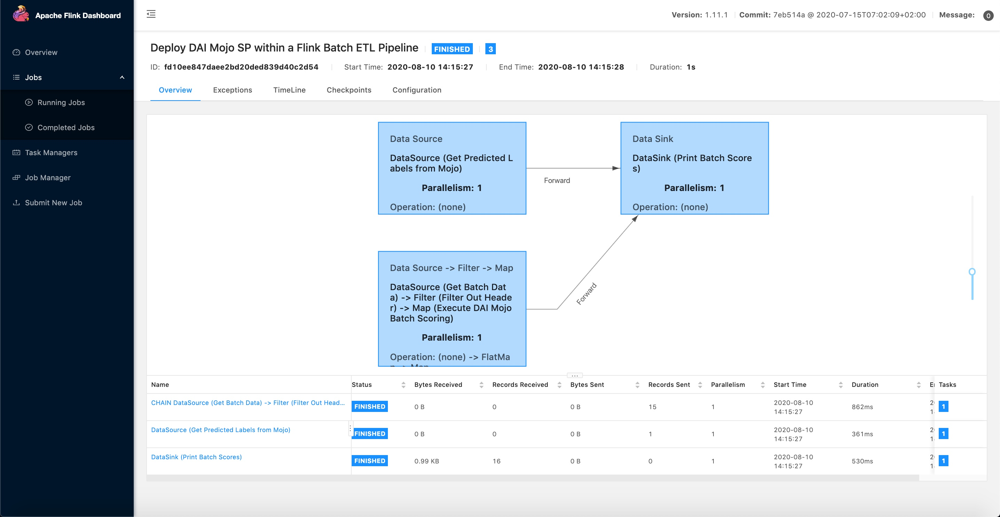
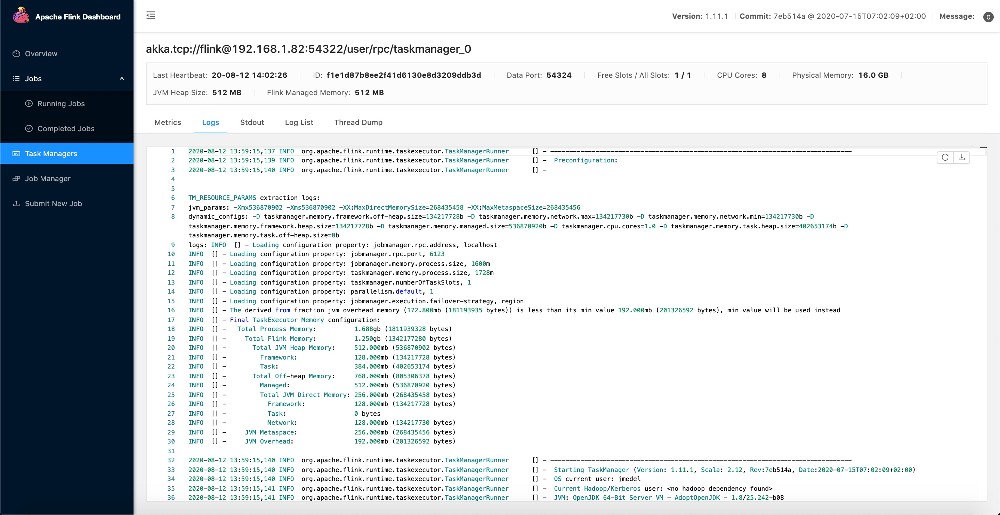
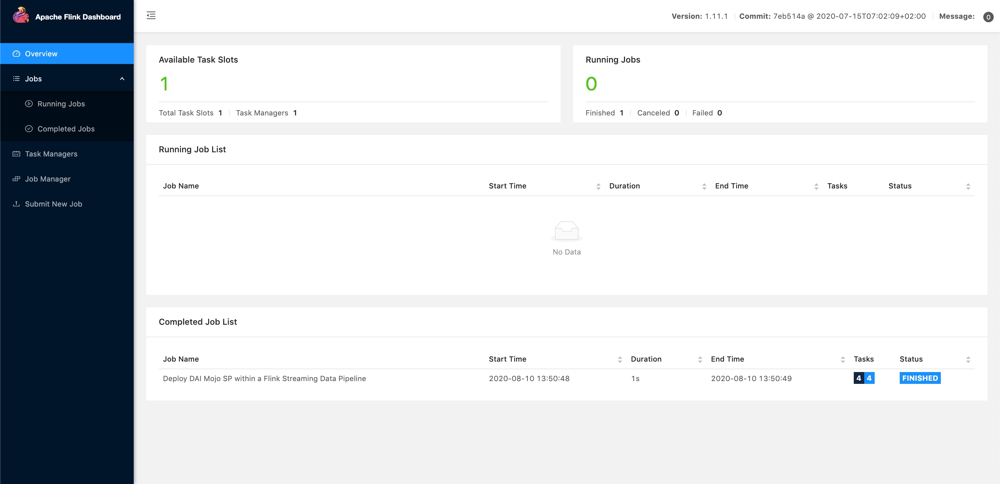
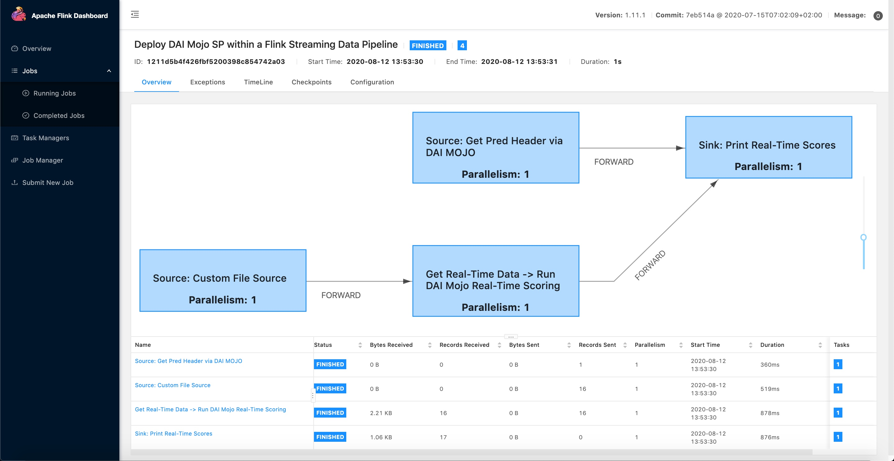
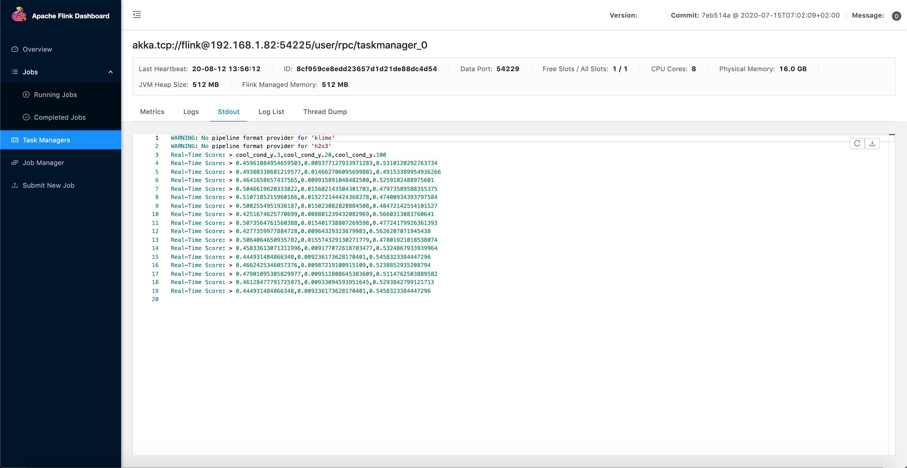

# Deploy Driverless AI MOJO within a Flink Data Pipeline

## Cloudera Integration Point for CDF

Deploy the Driverless AI MOJO Scoring Pipeline to Apache Flink by using the MOJO2 Java Runtime API and a custom Flink RichMapFunction. This will be a Cloudera Integration point for Cloudera Data Flow (CDF), particulary Cloudera Streaming Analytics(CSA). CSA is powered by Apache Flink.

## Prerequisites

- Driverless AI Environment (Tested with Driverless AI 1.8.7.1, MOJO Scoring Pipeline 2.4.2)

- Launch Ubuntu 18.04 Linux EC2 instance
    - Instance Type: t2.2xlarge
    - Storage: 256GB
    - Open custom TCP port 8081 and source on 0.0.0.0/0
- Download the Driverless AI Deployment Repo to your local machine since we will be using the Flink Data Pipeline java programs that come with mojo-flink/ folder.

~~~bash
git clone -b mojo-flink https://github.com/james94/dai-deployment-examples/
~~~

## Task 1: Set Up Environment

### Connect to EC2 from Local Machine

1\. Move the EC2 Pivate Key File (Pem Key) to the .ssh folder

~~~bash
# Move Private Key to .ssh folder
mv $HOME/Downloads/{private-key-filename}.pem $HOME/.ssh/

# Set Private Key permissions to 400 to avoid SSH permission denied
chmod 400 $HOME/.ssh/{private-key-filename}.pem
~~~

2\. Set EC2 Public DNS and EC2 Pem Key as permanent environment variables

~~~bash
# For Mac OS X, set permanent environment variables 
tee -a $HOME/.bash_profile << EOF
# Set EC2 Public DNS
export H2O_DAI_SCORING_INSTANCE={EC2 Public DNS}.compute.amazon.com
# Set EC2 Pem Key
export H2O_DAI_SCORING_PEM=$HOME/.ssh/{private-key-filename}.pem
EOF

# For Linux, set permanent environment variables
tee -a $HOME/.profile << EOF
# Set EC2 Public DNS
export H2O_DAI_SCORING_INSTANCE={EC2 Public DNS}.compute.amazon.com
# Set EC2 Pem Key
export H2O_DAI_SCORING_PEM=$HOME/.ssh/{private-key-filename}.pem
EOF

source $HOME/.bash_profile
~~~

3. Connect to EC2 via SSH

~~~bash
# Connect to EC2 instance using SSH
ssh -i $H2O_DAI_SCORING_PEM ubuntu@$H2O_DAI_SCORING_INSTANCE
~~~

### Create Environment Directory Structure

1. Run the following commands that will create the directories where you could store the **input data**, **mojo-pipeline/** folder.

~~~bash
# Create directory structure for DAI MOJO Flink Projects

# Create directory where the mojo-pipeline/ folder will be stored
mkdir $HOME/daimojo-flink/

# Create input directory used for batch scoring or real-time scoring
mkdir -p $HOME/daimojo-flink/testData/{test-batch-data,test-real-time-data}
~~~

### Set Up Driverless AI MOJO Requirements in EC2

1\. Build a **Driverless AI Experiment**

- 1a. Upload your dataset or use the following **Data Recipe URL** to import the **UCI Hydraulic System Condition Monitoring Dataset**:

~~~bash
# Data Recipe URL
https://raw.githubusercontent.com/james94/driverlessai-recipes/master/data/hydraulic-data.py
~~~

- 1b. Split the data **75% for training** and **25% for testing**.

- 1c. Run predict on your **training data**.

- 1d. Name the experiment **model_deployment**. Choose the **target column** for scoring. Choose the **test data**. Launch the experiment.

2\. Click **Download MOJO Scoring Pipeline** in Driverless AI Experiment Dashboard

- 2a. Select **Java**, click **Download MOJO Scoring Pipeline** and send **mojo.zip** to EC2.

~~~bash
# Move Driverless AI MOJO Scoring Pipeline to EC2 instance
scp -i $H2O_DAI_SCORING_PEM $HOME/Downloads/mojo.zip ubuntu@$H2O_DAI_SCORING_INSTANCE:/home/ubuntu/daimojo-flink/
~~~

- 2b. Unzip **mojo.zip**.

~~~bash
sudo apt -y install unzip
cd /home/ubuntu/daimojo-flink/
unzip mojo.zip
~~~

3\. Install **MOJO2 Java Runtime Dependencies** in EC2

- 3a. Download and install Anaconda.

~~~bash
# Download Anaconda
wget https://repo.anaconda.com/archive/Anaconda3-2020.02-Linux-x86_64.sh

# Install Anaconda
bash Anaconda3-2020.02-Linux-x86_64.sh
~~~

- 3b. Create **model-deployment** virtual environment and install the **required packages**

~~~bash
# Install Python 3.6.10
conda create -y -n model-deployment python=3.6
conda activate model-deployment

# Install Java
conda install -y -c conda-forge openjdk=8.0.192

# Install Maven
conda install -y -c conda-forge maven
~~~

4\. Set the **Driverless AI License Key** as a **temporary environment variable**

~~~bash
# Set Driverless AI License Key
export DRIVERLESS_AI_LICENSE_KEY="{license-key}"
~~~

### Set Up Flink Local Cluster in EC2

1\. Download **Flink**

~~~bash
cd $HOME
# Download Flink
wget https://downloads.apache.org/flink/flink-1.11.1/flink-1.11.1-bin-scala_2.12.tgz

# Extract Flink tgz
tar -xvf flink-1.11.1-bin-scala_2.12.tgz
~~~

2\. Start the Local Flink Cluster

~~~bash
cd $HOME/flink-1.11.1

# Start Flink
./bin/start-cluster.sh

# Stop Flink
./bin/stop-cluster.sh
~~~

3\. Access the Flink UI: http://localhost:8081/#/overview

### Prepare Hydraulic Test Data For Mojo Flink Scoring

Make sure there is **input test data** in the input directory Flink will be pulling data from.

1\. For **batch scoring**, you should make sure there is one or more files with multiple rows of csv data in the following directory:

~~~bash
# go to mojo-pipeline/ directory with batch data example.csv
cd $HOME/daimojo-flink/mojo-pipeline/

# copy this batch data to the input dir where Flink pulls the batch data
cp example.csv $HOME/daimojo-flink/testData/test-batch-data/
~~~

2\. For real-time scoring, you should make sure there are files with a single row of csv data in the following directory:

~~~bash
# go to real-time input dir where we will store real-time data
cd $HOME/daimojo-flink/testData/test-real-time-data/

# copy example.csv to the input dir where Flink pulls the real-time data
cp $HOME/daimojo-flink/mojo-pipeline/example.csv .

# remove file's 1st line, the header
echo -e "$(sed '1d' example.csv)\n" > example.csv

# split example.csv into smaller real-time files each with 1 line
split -l 1 example.csv test_

# add .csv extension to all test_* files in folder
for f in test* ; do mv "$f" "${f}.csv"; done

# remove example.csv from real-time input dir
rm -rf example.csv
~~~

### Compile Flink MOJO ML Data Pipeline Jobs

1\. Download **Driverless AI Deployment Examples** Repo for **Flink** assets

~~~bash
cd $HOME
git clone -b mojo-flink https://github.com/james94/dai-deployment-examples/
~~~

2\. Compile the Java code for **Flink MOJO ML Data Pipeline** jobs into a **JAR package**

~~~bash
cd $HOME/dai-deployment-examples/mojo-flink/daimojo-flink-data-pipeline
mvn clean install
~~~

## Task 2: Deploy MOJO Scoring Pipeline to Flink

### Batch Scoring

For Driverless AI MOJO batch scoring in Flink, we will run the following Flink MOJO ML Data Pipeline program **BatchPredHydCoolCond.java** by specifying this class as the entry point for the local Flink cluster to execute.

1\. Run the following command to submit the **Flink MOJO Batch Scoring Job** to the Flink Cluster JobManager for execution:

~~~bash
$HOME/flink-1.11.1/bin/flink run -c org.apache.h2o.daimojo.flink.datapipeline.ClassifyHydCoolCond.BatchPredHydCoolCond $HOME/dai-deployment-examples/mojo-flink/daimojo-flink-data-pipeline/target/daimojo-flink-data-pipeline-1.11.1.jar
~~~

2\. Once the Flink job finishes running, it will transition to the Completed Job List:

3\. To view a ETL Pipeline diagram of Flink Job **Deploy DAI Mojo SP within a Flink Batch ETL Pipeline**, click on the Job’s name:

4\. To view the logs for this Flink job, click on one of the blue boxes, click on TaskManagers, click on LOG:

5\. To view the Batch Scores for Hydraulic Cooling Condition, click on the TaskManager's Stdout:

### Real-Time Scoring

For Driverless AI MOJO batch scoring in Flink, we will run the following Flink MOJO ML Data Pipeline program **RealTimePredHydCoolCond.java** by specifying this class as the entry point for the local Flink cluster to execute.

1\. Run the following command to submit the Flink MOJO Stream Scoring Job for execution:

~~~bash
$HOME/flink-1.11.1/bin/flink run -c org.apache.h2o.daimojo.flink.datapipeline.ClassifyHydCoolCond.RealTimePredHydCoolCond $HOME/dai-deployment-examples/mojo-flink/daimojo-flink-data-pipeline/target/daimojo-flink-data-pipeline-1.11.1.jar
~~~

2\. Once the Flink job finishes running, it will transition to the Completed Job List:

3\. Check out the Data Pipeline diagram of the Flink Job **Deploy DAI Mojo SP within a Flink Streaming Data Pipeline**:

4\. View the Real-Time Scores for Hydraulic Cooling Condition by looking at the TaskManager's Stdout:

