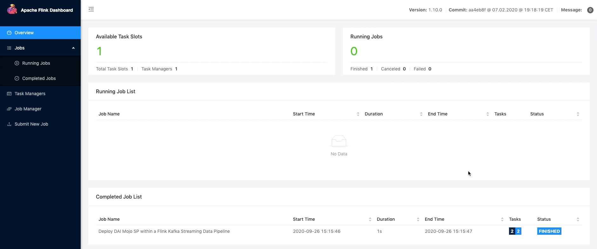
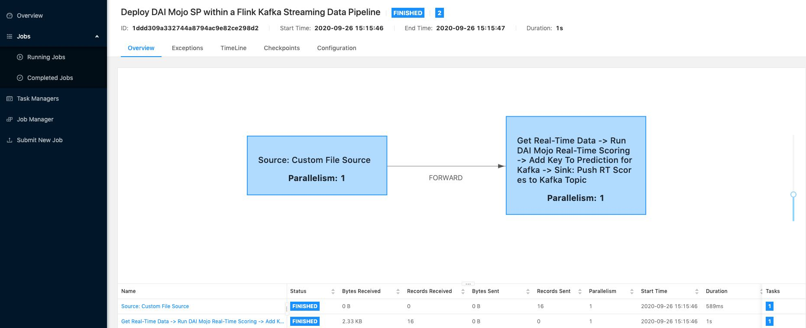
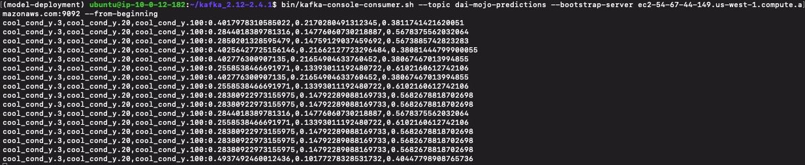

# Send Driverless AI MOJO Predictions to Kafka using FlinkKafkaProducer

## Cloudera Integration Point for CDF

Deploy the Driverless AI MOJO Scoring Pipeline to Apache Flink by using the MOJO2 Java Runtime API and a custom Flink RichMapFunction. Send the predictions performed by the MOJO to a Kafka topic using FlinkKafkaProducer. This will be a Cloudera Integration point for Cloudera Data Flow (CDF), particulary Cloudera Streaming Analytics(CSA). CSA is powered by Apache Flink.

## Video Walkthrough

The following link is a YouTube video that shows how to deploy the Driverless AI MOJO to Flink to perform real-time predictions on Hydraulic System data to clasify for Hydraulic Cooling Condition and then send those predictions to a Kafka topic: [Send Driverless AI MOJO Predictions to Kafka using FlinkKafkaProducer](https://youtu.be/hqd3ebEqkuk)

## Prerequisites

- Driverless AI Environment (Tested with Driverless AI 1.9.0, MOJO Scoring Pipeline 2.4.8)

- Launch Ubuntu 18.04 Linux EC2 instance
    - Instance Type: t2.2xlarge
    - Storage: 128GB
    - Open traffic on all ports on 0.0.0.0/0

## Task 1: Set Up Environment

### Connect to EC2 from Local Machine

~~~bash
# Connect to EC2 instance using SSH
ssh -i $DAI_MOJO_CDF_PEM ubuntu@$DAI_MOJO_CDF_INSTANCE
~~~

### Create Environment Directory Structure

~~~bash
mkdir -p $HOME/dai-model-deployment/testData/{test-batch-data,test-real-time-data}
~~~

### Set Up Driverless AI MOJO Requirements in EC2

1\. Build a **Driverless AI Experiment**

2\. Send **mojo.zip** to EC2 instance

~~~bash
# Send DAI MOJO SP from local machine to EC2 instance
scp -i $DAI_MOJO_CDF_PEM $HOME/Downloads/mojo.zip ubuntu@$DAI_MOJO_CDF_INSTANCE:/home/ubuntu/dai-model-deployment/

# On EC2 instance, extract mojo.zip
cd $HOME/dai-model-deployment/
sudo apt -y install unzip
unzip mojo.zip
~~~

3\. Install **package dependencies** for MOJO2 Java Runtime

~~~bash
wget https://repo.anaconda.com/archive/Anaconda3-2020.02-Linux-x86_64.sh -O $HOME/anaconda.sh
bash $HOME/anaconda.sh
source ~/.bashrc
conda create -y -n model-deployment python=3.6
conda activate model-deployment
conda install -y -c conda-forge openjdk=8.0.192
conda install -y -c conda-forge maven
~~~

4\. Set **temporary environment variable** for **Driverless AI License File**

~~~bash
scp -i $DAI_MOJO_CDF_PEM $HOME/Downloads/license.sig ubuntu@$DAI_MOJO_CDF_INSTANCE:/home/ubuntu/
export DRIVERLESS_AI_LICENSE_FILE="/home/ubuntu/license.sig"
~~~

### Prepare Hydraulic Test Data For Mojo Flink Scoring

1\. Setup batch data in test-batch-data folder:

~~~bash
cd /home/ubuntu/dai-model-deployment/mojo-pipeline/
cp example.csv /home/ubuntu/dai-model-deployment/testData/test-batch-data/
~~~

2\. Setup real-time data in test-real-time-data folder:

~~~bash
cd /home/ubuntu/dai-model-deployment/testData/test-real-time-data/
cp /home/ubuntu/dai-model-deployment/mojo-pipeline/example.csv .
echo -e "$(sed '1d' example.csv)\n" > example.csv
split -dl 1 --additional-suffix=.csv example.csv test_
rm -rf example.csv
~~~

### Set Up Kafka Local Cluster in EC2

1\. Download **Kafka**

~~~bash
cd $HOME
wget http://apache.mirrors.hoobly.com/kafka/2.4.1/kafka_2.12-2.4.1.tgz
tar xzf kafka_2.12-2.4.1.tgz
cd kafka_2.12-2.4.1
~~~

2\. Start the **Kafka Environment**

In the current terminal, start the Zookeeper service

~~~bash
# Start the ZooKeeper service
bin/zookeeper-server-start.sh config/zookeeper.properties
~~~

Open a new terminal to EC2, start the Kafka broker service

~~~bash
# Start the Kafka broker service
cd kafka_2.12-2.4.1

bin/kafka-server-start.sh config/server.properties
~~~

3\. Open a new terminal to EC2, create a **dai-mojo-predictions** Kafka topic to store your predictions

~~~bash
cd kafka_2.12-2.4.1

bin/kafka-topics.sh --create \
  --zookeeper ${EC2_PUBLIC_DNS}:2181 \
  --replication-factor 1 --partitions 1 \
  --topic dai-mojo-predictions
~~~

### Set Up Flink Local Cluster in EC2

1\. Download **Flink**

~~~bash
cd $HOME
wget https://archive.apache.org/dist/flink/flink-1.10.0/flink-1.10.0-bin-scala_2.12.tgz
tar xzf flink-1.10.0-bin-scala_2.12.tgz
~~~

2\. Add Driverless AI License File JVM System Property for all Flink processes to `flink-conf.yaml`

~~~bash
echo "# Java options to start the JVM of all Flink processes with" | tee -a /home/ubuntu/flink-1.10.0/conf/flink-conf.yaml
echo "env.java.opts=\"-Dai.h2o.mojos.runtime.license.file=/home/ubuntu/license.sig\"" | tee -a /home/ubuntu/flink-1.10.0/conf/flink-conf.yaml
~~~

3\. Start the Local Flink Cluster

~~~bash
cd $HOME/flink-1.10.0
./bin/start-cluster.sh
# ./bin/stop-cluster.sh
~~~

4\. Access the Flink UI: http://${EC2_PUBLIC_DNS}:8081/#/overview

### Compile Flink Kafka MOJO ML Data Pipeline Jobs

1\. Open a new terminal to EC2, download **Driverless AI Deployment Examples** Repo and compile the Java code for **Flink MOJO ML Data Pipeline** jobs into a **JAR package**

~~~bash
cd $HOME
git clone https://github.com/h2oai/dai-deployment-examples
cd $HOME/dai-deployment-examples/mojo-flink/daimojo-flink-data-pipeline
mvn clean install
~~~

## Task 2: Deploy MOJO Scoring Pipeline to Flink to send to Kafka

### Real-Time Scoring

1\. Submit a Flink Kafka MOJO Stream Scoring Job for execution:

~~~bash
$HOME/flink-1.10.0/bin/flink run -c org.apache.h2o.daimojo.flink.datapipeline.ClassifyHydCoolCond.RealTimePredHydCoolCondKafka $HOME/dai-deployment-examples/mojo-flink/daimojo-flink-data-pipeline/target/daimojo-flink-data-pipeline-1.10.0.jar --topic dai-mojo-predictions --bootstrap.servers ${EC2_PUBLIC_DNS}:9092 --zookeeper.connect ${EC2_PUBLIC_DNS}:2181
~~~

2\. Once the Flink job finishes running, it will transition to the Completed Job List:

3\. Check out the Data Pipeline diagram of the Flink Job **Deploy DAI Mojo SP within a Flink Kafka Streaming Data Pipeline**:

4\. Open a new terminal to EC2, view the Real-Time Scores by reading the predictions from the Kafka topic:

~~~bash
cd kafka_2.12-2.4.1

bin/kafka-console-consumer.sh --topic dai-mojo-predictions \
  --bootstrap-server ${EC2_PUBLIC_DNS}:9092 \
  --from-beginning
~~~

## Conclusion

Congratulations, we just deployed a **Driverless AI MOJO Scoring Pipeline** within a **Flink Kafka Data Pipeline** to do **real-time scoring**. As a recap, we set up the environment in an AWS EC2 instance by setting up the Driverless AI MOJO Scoring Pipeline requirements, setting up Flink and Kafka on a single node and preparing some test data to be used for batch scoring or real-time scoring. With the environment setup, we used a custom Flink DaiMojoTransform RichMapFunction within a Flink Real-Time Data Pipeline to score our data and send those predictions to a **Kafka topic** using **FlinkKafkaProducer**. By reading the Kafka topic, we were able to see the results from real-time scoring.