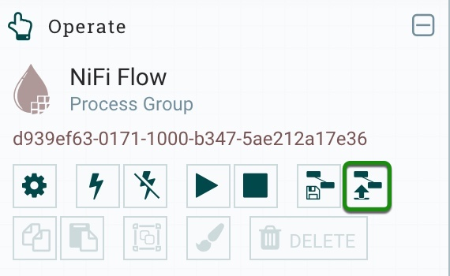
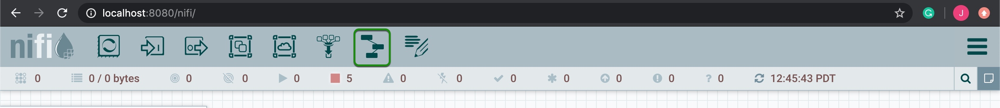
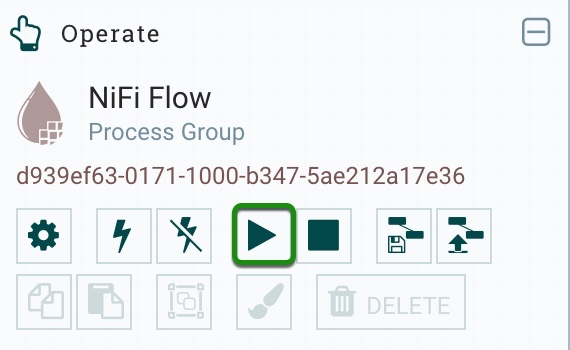

# Deploy Driverless AI MOJO within a NiFi Data Flow

## Cloudera Integration Point for CDF

Deploy the Driverless AI MOJO Scoring Pipeline to Apache NiFi by using the MOJO2 Java Runtime API and a custom NiFi processor. This will be a Cloudera Integration point for Cloudera Data Flow (CDF), particulary Cloudera Flow Management (CFM). CFM is powered by Apache NiFi.

## Video Walkthrough

The following link is a YouTube video that shows how to deploy the Driverless AI MOJO to NiFi to do batch and real-time scoring on Hydraulic System data to classify for Hydraulic Cooling Condition: [NiFi Custom Processor for Running the Driverless AI MOJO in NiFi DataFlow](https://youtu.be/c401tSqySS0)

## Prerequisites

- Driverless AI Environment (Tested with Driverless AI 1.8.7.1, MOJO Scoring Pipeline 2.4.2)

- Launch Ubuntu 18.04 Linux EC2 instance
    - Instance Type: t2.2xlarge
    - Storage: 256GB
    - Open custom TCP port 8080 and source on 0.0.0.0/0

- Download the Driverless AI Deployment Repo to your local machine since we will be using the NiFi Data Flow xml templates that come with mojo-nifi/ folder.

~~~bash
git clone -b mojo-nifi https://github.com/james94/dai-deployment-examples/
~~~

## Task 1: Set Up Environment

### Connect to EC2 from Local Machine

1\. Move the EC2 Pivate Key File (Pem Key) to the .ssh folder

~~~bash
mv $HOME/Downloads/{private-key-filename}.pem $HOME/.ssh/
chmod 400 $HOME/.ssh/{private-key-filename}.pem
~~~

2\. Set EC2 Public DNS and EC2 Pem Key as permanent environment variables

~~~bash
# For Mac OS X, set permanent environment variables 
tee -a $HOME/.bash_profile << EOF
# Set EC2 Public DNS
export DAI_MOJO_NIFI_INSTANCE={EC2 Public DNS}.compute.amazon.com
# Set EC2 Pem Key
export DAI_MOJO_NIFI_PEM=$HOME/.ssh/{private-key-filename}.pem
EOF

# For Linux, set permanent environment variables
tee -a $HOME/.profile << EOF
# Set EC2 Public DNS
export DAI_MOJO_NIFI_INSTANCE={EC2 Public DNS}.compute.amazon.com
# Set EC2 Pem Key
export DAI_MOJO_NIFI_PEM=$HOME/.ssh/{private-key-filename}.pem
EOF

source $HOME/.bash_profile
~~~

3\. Connect to EC2 via SSH

~~~bash
ssh -i $DAI_MOJO_NIFI_PEM ubuntu@$DAI_MOJO_NIFI_INSTANCE
~~~

### Create Environment Directory Structure

1\. Run the following commands that will create the directories where you could store the **input data**, **mojo-pipeline/** folder.

~~~bash
# Create directory structure for DAI MOJO NiFi Projects
mkdir $HOME/daimojo-nifi/

mkdir -p $HOME/daimojo-nifi/testData/{test-batch-data,test-real-time-data}
~~~

### Set Up Driverless AI MOJO Scoring Pipeline in EC2

1\. Build a **Driverless AI Experiment**

- 1a\. Upload your dataset or use the following **Data Recipe URL** to import the **UCI Hydraulic System Condition Monitoring Dataset**:

~~~bash
# Data Recipe URL
https://raw.githubusercontent.com/james94/driverlessai-recipes/master/data/hydraulic-data.py
~~~

- 1b\. Split the data **75% for training** and **25% for testing**.

- 1c\. Run predict on your **training data**.

- 1d\. Name the experiment **model_deployment**. Choose the **target column** for scoring. Choose the **test data**. Launch the experiment.

2\. Click **Download MOJO Scoring Pipeline** in Driverless AI Experiment Dashboard

- 2a\. Select **Java**, click **Download MOJO Scoring Pipeline** and send **mojo.zip** to EC2.

~~~bash
# Move Driverless AI MOJO Scoring Pipeline to EC2 instance
scp -i $DAI_MOJO_NIFI_PEM $HOME/Downloads/mojo.zip ubuntu@$DAI_MOJO_NIFI_INSTANCE:/home/ubuntu/daimojo-nifi/
~~~

- 2b\. Unzip **mojo.zip**.

~~~bash
sudo apt -y install unzip
cd $HOME/daimojo-nifi/
unzip mojo.zip
~~~

3\. Install **MOJO2 Java Runtime Dependencies** in EC2

- 3a\. Download and install Anaconda.

~~~bash
# Download, then install Anaconda
wget https://repo.anaconda.com/archive/Anaconda3-2020.02-Linux-x86_64.sh

bash Anaconda3-2020.02-Linux-x86_64.sh
~~~

- 3b\. Create **model-deployment** virtual environment

~~~bash
conda create -y -n model-deployment python=3.6
conda activate model-deployment
~~~

- 3c\. Install the **required packages**:

~~~bash
# Install Java
conda install -y -c conda-forge openjdk=8.0.192

# Install Maven
conda install -y -c conda-forge maven
~~~

4\. Set the **Driverless AI License Key** as a **temporary environment variable**

~~~bash
# Set Driverless AI License Key
export DRIVERLESS_AI_LICENSE_KEY="{license-key}"
~~~

### Prepare Hydraulic Test Data For Mojo NiFi Scoring

Make sure there is **input test data** in the input directory NiFi will be pulling data from.

1\. For **batch scoring**, you should make sure there is one or more files with multiple rows of csv data in the following directory:

~~~bash
# go to mojo-pipeline/ directory with batch data example.csv
cd $HOME/daimojo-nifi/mojo-pipeline/

# copy this batch data to the input dir where NiFi pulls the batch data
cp example.csv $HOME/daimojo-nifi/testData/test-batch-data/
~~~

2\. For **real-time scoring**, you should make sure there are files with a single row of csv data in the following directory:

~~~bash
# go to real-time input dir where we will store real-time data
cd $HOME/daimojo-nifi/testData/test-real-time-data/

# copy example.csv to the input dir where NiFi pulls the real-time data
cp $HOME/daimojo-nifi/mojo-pipeline/example.csv .

# remove file's 1st line, the header
echo -e "$(sed '1d' example.csv)\n" > example.csv

# split file into multiple files having 1 row of data with numeric suffix and .csv extension
split -dl 1 --additional-suffix=.csv example.csv test_

# remove example.csv from real-time input dir
rm -rf example.csv
~~~

### Set Up NiFi in EC2

1\. Download **NiFi**

~~~bash
cd $HOME
# Download NiFi
wget https://downloads.apache.org/nifi/1.11.4/nifi-1.11.4-bin.tar.gz
# Extract NiFi tar.gz
tar -xvf nifi-1.11.4-bin.tar.gz
~~~

### Compile Custom MOJO NiFi Processor

1\. Download **Driverless AI Deployment Examples** Repo for **NiFi** assets

~~~bash
cd $HOME
git clone -b mojo-nifi https://github.com/james94/dai-deployment-examples/
~~~

2\. Compile the Java code for the NiFi processor into a **NAR package**:

~~~bash
cd $HOME/dai-deployment-examples/mojo-nifi/nifi-nar-bundles/nifi-daimojo-record-bundle/
mvn clean install
~~~

### Add Custom NiFi Processor to NiFi

1\. Copy over the NiFi NAR file **nifi-h2o-record-nar-1.11.4.nar**, which contains the Java MOJO NiFi processor to the NiFi **lib/** folder:

~~~bash
cd $HOME/nifi-1.11.4/lib/

# copy nifi h2o nar to current folder
cp $HOME/dai-deployment-examples/mojo-nifi/nifi-nar-bundles/nifi-daimojo-record-bundle/nifi-daimojo-record-nar/target/nifi-daimojo-record-nar-1.11.4.nar .
~~~

### Start the NiFi Server in EC2

1\. Start the NiFi server where we import NiFi data flows to do batch scoring or real-time scoring

~~~bash
cd $HOME/nifi-1.11.4/

# start nifi server
./bin/nifi.sh start

# stop nifi server
# ./bin/nifi.sh stop
~~~

2\. Access the NiFi UI: http://localhost:8080/nifi/

## Task 2: Deploy MOJO Scoring Pipeline to NiFi

### Import the NiFi Data Flow Template into NiFi in EC2

1\. On the left side of the NiFi canvas there is an Operate Panel. Click on the **upload button** to upload a NiFi Data Flow Template from your local machine:

2\. Choose one of the following NiFi Data Flow xml templates from your local machine to upload to NiFi:

~~~bash
# NiFi Data Flow Template executes MOJO for batch scoring
$HOME/dai-deployment-examples/mojo-nifi/nifi-dataflow-templates/BatchPredHydCoolCond.xml

# NiFi Data Flow Template executes MOJO for real-time scoring
$HOME/dai-deployment-examples/mojo-nifi/nifi-dataflow-templates/RealTimePredHydCoolCond.xml
~~~

3\. Drag and drop the NiFi template component onto the NiFi canvas.

4\. Select the NiFi Data Flow template you just uploaded. 

- If you uploaded **BatchPredHydCoolCond** template, then select it. 
- Else if you uploaded **RealTimePredHydCoolCond** template, then select it.

### Start the NiFi Data Flow

Start the NiFi Flow to do **batch scoring** or **real-time scoring**

1\. In the Operate Panel, click the **start button** to run the NiFi Flow. 

You should see all processors red stop icon change to a green play icon in their left corner.

2\. Once the NiFi Flow has pulled in the Hydraulic data, performed predictions on the data using the **ExecuteDaiMojoScoringPipeline** processor, then click the **stop button** in the Operate Panel.

### Batch Scoring

If you uploaded the **BatchPredHydCoolCond** flow template, ran the flow and then stopped it, you should see the following NiFi Flow:

Here we look at a provenance event from PutFile processor for when NiFi executed the MOJO on some batch data (multiple rows of data) to do batch scoring. 

1\. Right click on the PutFile processor, choose Data Provenance.

2\. Choose the first event in the list and click on the **i** on the left corner of the first row.

3\. A provenance event window should appear, then in the output side of the window, click on view to see the batch scores.

### Interactive Scoring

If you uploaded the **RealTimePredHydCoolCond** flow template, ran the flow and then stopped it, you should see the following NiFi Flow:

Here we look at a provenance event from PutFile processor for when NiFi executed the MOJO on some real-time data (one row of data) to do real-time scoring. 

