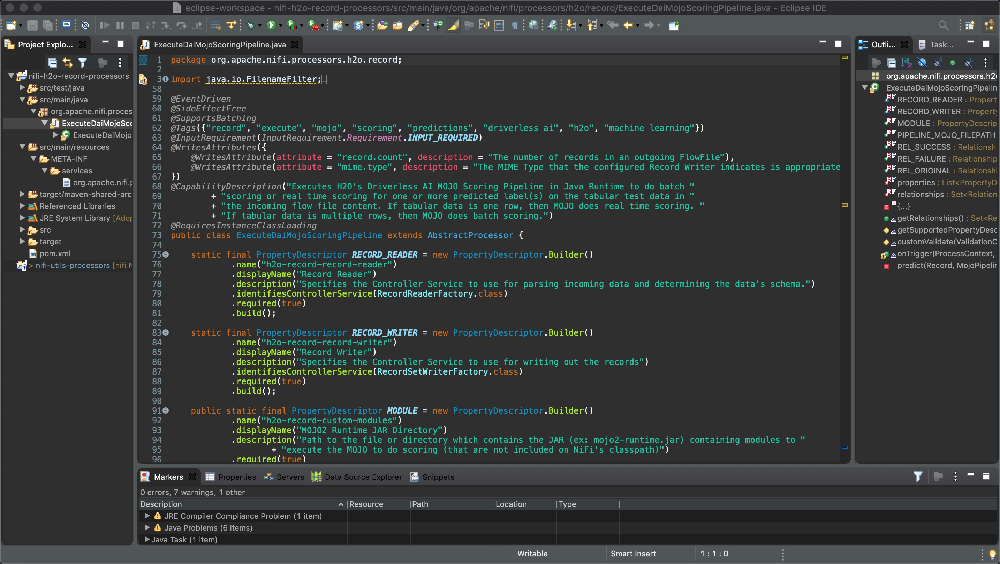
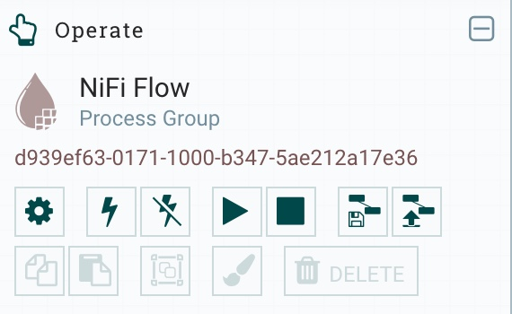
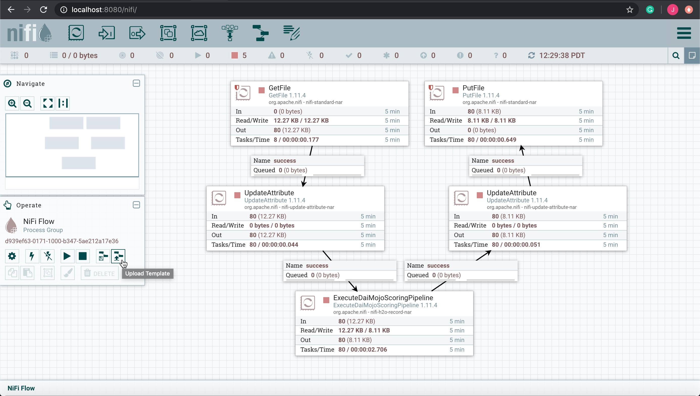
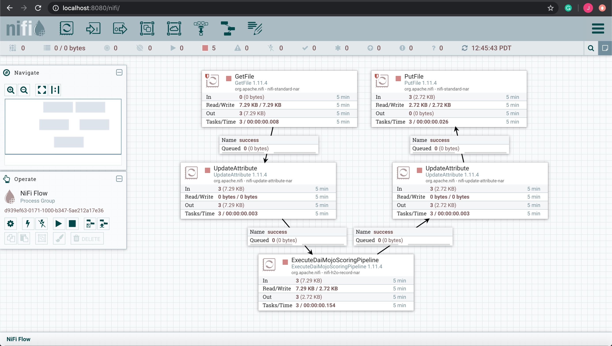
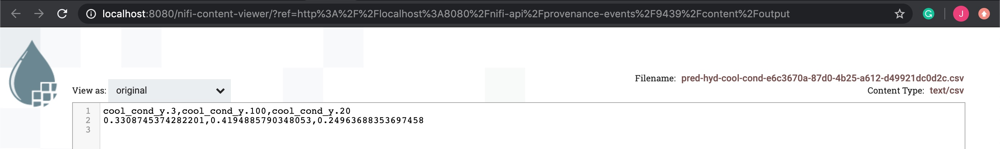
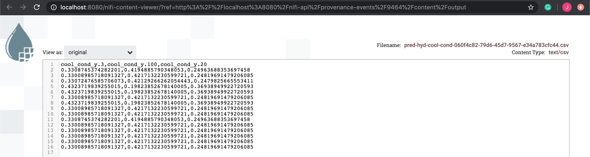

# NiFi Custom Processor for Running the MOJO in NiFi Data Flow

## Cloudera Integration Point (CDF)

Integrate the Driverless AI MOJO Scoring Pipeline into Apache NiFi through a custom processor. This will be a Cloudera Integration point for Cloudera Data Flow (CDF), particulary Cloudera Flow Management (CFM). CFM is powered by Apache NiFi.

## Prerequisites

- Java >= 7 runtime (JDK >= 1.7)

- Hydraulic Sensor Test Data Set
    - comes with this repo under `model-deployment/common/hydraulic/testData/`

- MOJO2 Runtime JAR
    - comes with this repo under `model-deployment/common/mojo2-runtime/java-runtime/java/mojo2-runtime.jar`

- Pipeline MOJO File
    - comes with this repo under `model-deployment/common/hydraulic/mojo-pipeline/pipeline.mojo`

- Recommend Set **DRIVERLESS_AI_LICENSE_KEY** as an environment variable for OS that NiFi runs on
    - you will need to get Driverless AI product to get the License Key

~~~bash
# Linux user
echo "export DRIVERLESS_AI_LICENSE_KEY={license_key}" >> ~/.profile

# Mac user
echo "export DRIVERLESS_AI_LICENSE_KEY={license_key}" >> ~/.bash_profile
~~~

- Download the latest version of NiFi: http://nifi.apache.org/download.html

If you have not downloaded the dai-deployment-examples repository, you can do so with the following command:

~~~bash
git clone https://github.com/h2oai/dai-deployment-examples
~~~

## Compile NiFi + MOJO Custom Processor via Maven

### Process For Developing the Processor

For developing the NiFi custom processor, I used Maven and Eclipse IDE. When using NiFi with Maven, there is the option to build a starter template for the custom processor you are going to build. To generate the starter template, I used the command: `mvn archetype:generate`. Next my plan was to work on the processor's code in Eclipse. I ran the command `mvn install` to compile the project. Then I ran `mvn eclipse:eclipse -DdownloadSource=true` to download the JARs needed for the project and so Eclipse would be aware of them. Then I opened Eclipse and imported the NiFi processor project folder [nifi-h2o-record-processors/](model-deployment/apps/nifi/nifi-nar-bundles/nifi-h2o-record-bundle/nifi-h2o-record-processors/) into Eclipse. 

When I was writing the code for the NiFi processor [ExecuteDaiMojoScoringPipeline.java](model-deployment/apps/nifi/nifi-nar-bundles/nifi-h2o-record-bundle/nifi-h2o-record-processors/src/main/java/org/apache/nifi/processors/h2o/record/ExecuteDaiMojoScoringPipeline.java), I realized I needed to add the package dependencies for using NiFi's Record Reader, NiFi's Record Writer and H2O's MOJO2 Runtime, so I updated the **nifi-h2o-record-processors/** folder's [pom.xml](model-deployment/apps/nifi/nifi-nar-bundles/nifi-h2o-record-bundle/nifi-h2o-record-processors/pom.xml) to be able to use them. Then I ran the command `mvn eclipse:eclipse -DdownloadSource=true`, then refreshed the Eclipse project. The NiFi package dependencies were downloaded, but for the MOJO2 Runtime, I told maven that the licensed MOJO2 Runtime JAR package would be provided by the user. Once all the Java code was written for the processor, I compiled the code with command: `mvn install`. When the code compiled successfully, I wrote a Junit test in Java [TestExecuteDaiMojoScoringPipeline.java](model-deployment/apps/nifi/nifi-nar-bundles/nifi-h2o-record-bundle/nifi-h2o-record-processors/src/test/java/org/apache/nifi/processors/h2o/record/TestExecuteDaiMojoScoringPipeline.java) for testing multiple properties and test cases for the processor. I recompiled the code and a NiFi Archive (NAR) was generated. We will talk more about the NAR soon.

If you want to add or update Java code for the NiFi processor, you can open your favorite IDE, then import the project. I will walk you through the brief steps to open the project in Eclipse:

~~~bash
cd dai-deployment-examples/mojo-nifi/model-deployment/apps/nifi/nifi-nar-bundles/nifi-h2o-record-bundle/

# Compile the project
mvn install

# Download the JAR package dependencies for the Eclipse project
mvn eclipse:eclipse -DdownloadSource=true
~~~

Import the NiFi processor project `dai-deployment-examples/mojo-nifi/model-deployment/apps/nifi/nifi-nar-bundles/nifi-h2o-record-processors/` in Eclipse:

**Figure 1:** NiFi processor "ExecuteDaiMojoScoringPipeline.java"

### Compile the Processor

Compile the Java code for the NiFi processor into a NAR package

~~~bash
cd dai-deployment-examples/mojo-nifi/model-deployment/apps/nifi/nifi-nar-bundles/nifi-h2o-record-bundle/
mvn install
~~~

## Add NiFi Custom Processor to NiFi product

Once you have compiled the NiFi custom processor, a NAR file will be generated. A NAR allows several components and their dependencies to be packaged together into a single package. A NAR package is provided ClassLoader isolation from other NAR packages. So when software from many different organizations is all hosted within the same environment, the Java ClassLoaders will not be an issue. 

The NiFi NAR for this processor can be found here:

~~~bash
dai-deployment-examples/mojo-nifi/model-deployment/apps/nifi/nifi-nar-bundles/nifi-h2o-record-bundle/nifi-h2o-record-nar/target/nifi-h2o-record-nar-1.11.4.nar
~~~

If you have not downloaded the latest version of NiFi, then download it. We need to copy this NAR file `nifi-h2o-record-nar-1.11.4.nar` over to the NiFi `lib/` directory:

~~~bash
# go into nifi lib/ folder
cd your/path/to/nifi-1.11.4/lib/

# copy nifi h2o nar to current folder
cp your/path/to/nifi-h2o-record-nar-1.11.4.nar .
~~~

Then we can start NiFi:

~~~bash
# go back to nifi base folder
cd ../

# start nifi
./bin/nifi.sh start
~~~

Access NiFi UI at http://localhost:8080/nifi/

> Note: It may take a few minutes for the NiFi server to load the NiFi UI application.

## Build a NiFi Flow to do Real-Time & Batch Scoring

You could a NiFi flow from scratch with the custom processor **ExecuteDaiMojoScoringPipeline** to do interactive scoring or batch scoring.

To make it easier to see how to run the MOJO in the NiFi flow, I have created two NiFi flow templates: one can do interactive (real-time) scoring and the other one can do batch scoring. It just depends on the data you are ingesting into the flow. If you ingest tabular data that has only 1 row of data in each file, then the **ExecuteDaiMojoScoringPipeline** will do real-time scoring. If you ingest tabular data that has multiple rows of data in each file, then the **ExecuteDaiMojoScoringPipeline** will do batch scoring.

Here are the two NiFi flow templates:

~~~bash
# NiFi Flow Template for batch scoring
model-deployment/apps/nifi/templates/predBatchesHydCoolCond.xml

# NiFi Flow Template for real-time scoring
model-deployment/apps/nifi/templates/predRealTimeHydCoolCond.xml
~~~

## Import NiFi Flow Template into NiFi

On the NiFi canvas, there is an operate panel on the left side. When it is expanded, there is an upload button for uploading the NiFi template

**Figure 2:** Import NiFi flow template

Upload one of the xml templates we talked about above for using the NiFi flow to execute the MOJO to do batch scoring or real-time scoring.

## NiFi Data Flow 

NiFi flow pulls in csv data. If you use **predRealTimeHydCoolCond.xml** template, then each file has one row of data. If you use **predBatchesHydCoolCond.xml**, then each file has multiple rows of data. Next the NiFi flow adds a new key value pair attribute for `schema.name = test-schema` to the flow file. Next the predictions are made on the flow file for hydraulic cooling condition. If you use the **predRealTimeHydCoolCond.xml** template, then real-time predictions are computed. If you use the **predBatchesHydCoolCond.xml** template, then batch predictions are computed. Next the NiFi flow adds another new key pair attribute for `filename = unique csv filename` and then the flow file is stored into a csv file on the local file system. 

**Figure 3:** NiFi Flow Runs MOJO Real-Time Scoring

**Figure 4:** NiFi Flow Runs MOJO Batch Scoring

## NiFi Run MOJO Real-Time Scores

Here we look at a provenance event from PutFile processor for when NiFi executed the MOJO on some real-time data (one row of data) to do real-time scoring. 

**Figure 5:** NiFi PutFile Data Provenance for Real-Time Score

## NiFi Run MOJO Batch Scores

Here we look at a provenance event from PutFile processor for when NiFi executed the MOJO on some batch data (multiple rows of data) to do batch scoring. 

**Figure 6:** NiFi PutFile Data Provenance for Batch Score