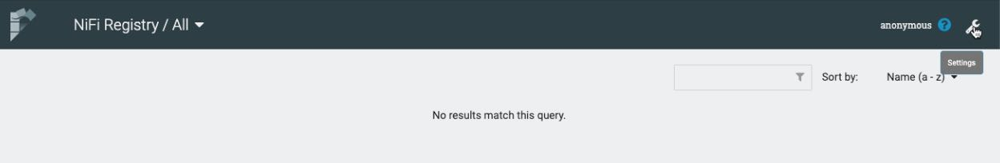
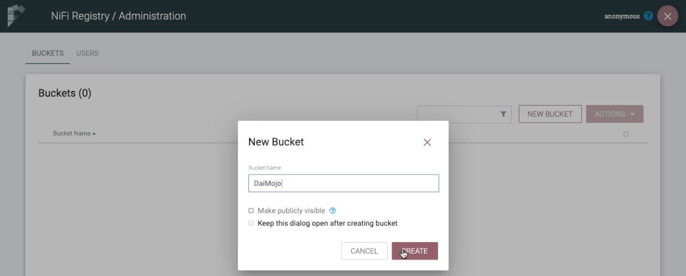
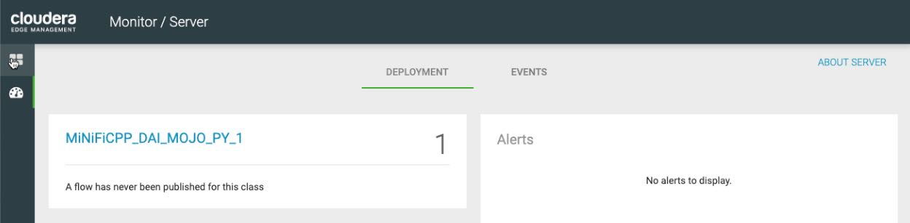
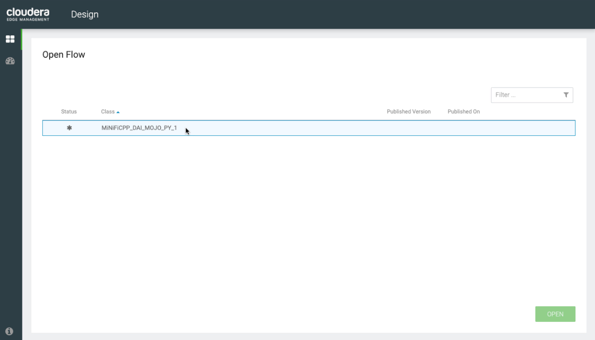
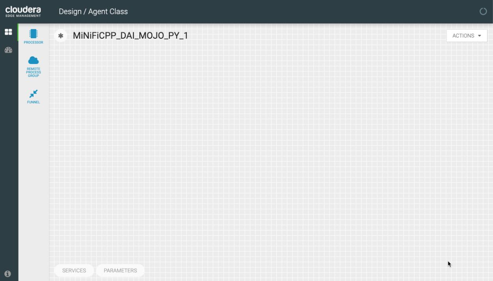
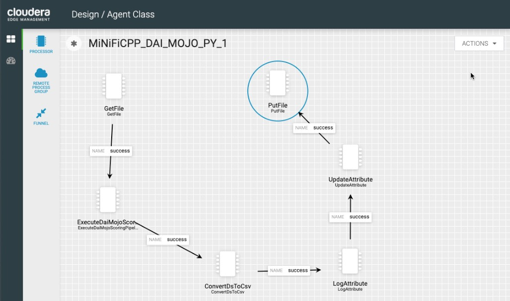
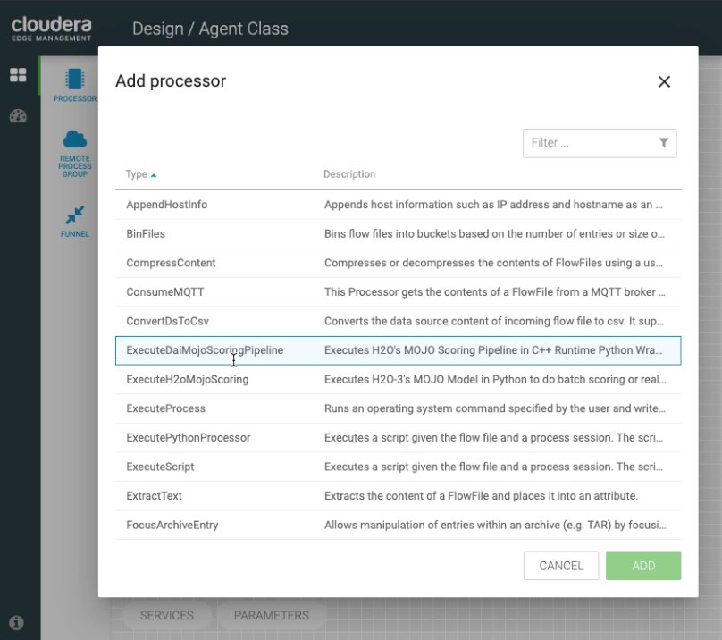
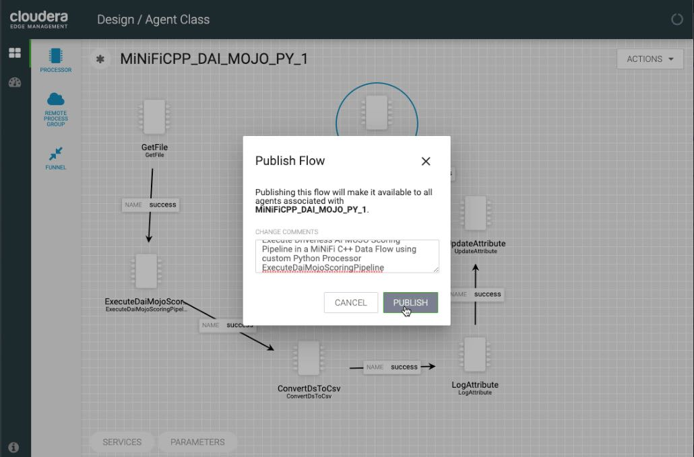
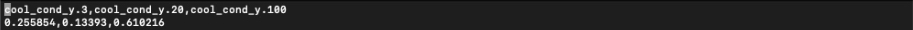

# Deploy Driverless AI MOJO Scoring Pipeline in a MiNiFi C++ Data Flow with CEM

## Cloudera Integration Point for CDF

Deploy a Driverless AI MOJO Scoring Pipeline to Apache MiNiFi C++ using the MOJO2 Python Runtime API and a custom MiNiFi Python processor "[ExecuteDaiMojoScoringPipeline.py](./nifi-minifi-cpp/minifi-python/h2o/dai/msp/ExecuteDaiMojoScoringPipeline.py)". This is a Cloudera integration point for Cloudera Data Flow (CDF), specifically Cloudera Edge Management (CEM). CEM consists of Edge Flow Manager (EFM), NiFi Registry and one or more Apache MiNiFi agents. **EFM** is proprietary and will **require credentials (username and password) provided by Cloudera** to download CEM. NiFi Registry and MiNiFi C++ are the open source parts of CEM. They do come included in the CEM tar.gz, but can also be downloaded from the open source. We will go through the setup of CEM on a single node EC2 instance. Then build a MiNiFi C++ Data Flow in EFM UI that uses our custom MiNiFi processor to execute a MOJO to perform predictions.

## Video Walkthrough

The following link is a YouTube video that shows how to install CEM (EFM + NiFi Registry + one MiNiFi C++ Agent) with Driverless AI MOJO Scoring Pipeline Requirements for MOJO2 Python Runtime API on a single Ubuntu EC2 instance:

- [Install Cloudera Edge Management (CEM) and Driverless AI MOJO2 Python Runtime on an Ubuntu EC2](https://youtu.be/q3dQcGXRdUg).

The following link is a YouTube video that shows how to deploy a Driverless AI MOJO Scoring Pipeline within a MiNiFi C++ Data Flow to do real-time scoring on Hydraulic System data and output Hydraulic Cooling Condition:

- [Deploy Driverless AI MOJO Scoring Pipeline in a MiNiFi C++ Data Flow with CEM](https://youtu.be/a_qRtBmQQlg).

## Prerequisites

- Driverless AI Environment (Tested with Driverless AI 1.9.0, MOJO Scoring Pipeline 2.4.8)

- Launch Ubuntu 18.04 Linux EC2 instance
    - Instance Type: t2.2xlarge
    - Storage: 128GB
    - Open traffic on all ports on 0.0.0.0/0

## Task 1: Set Up Environment

### Set Environment Variables for Interacting with EC2 from Local Machine

1\. Move the **EC2 Pivate Key File (Pem Key)** to the .ssh folder

~~~bash
mv $HOME/Downloads/{filename}.pem $HOME/.ssh/
chmod 400 $HOME/.ssh/{filename}.pem
~~~

2\. Set **EC2 Public DNS** and **EC2 Pem Key** as permanent environment variables

~~~bash
# For Mac OS X, set permanent environment variables
echo "export DAI_MOJO_CEM_INSTANCE={EC2 Public DNS}" | tee -a $HOME/.bash_profile
echo "export DAI_MOJO_CDF_PEM=$HOME/.ssh/{filename}.pem" | tee -a $HOME/.bash_profile
source $HOME/.bash_profile

# For Linux, set permanent environment variables
echo "export DAI_MOJO_CEM_INSTANCE={EC2 Public DNS}" | tee -a $HOME/.profile
echo "export DAI_MOJO_CDF_PEM=$HOME/.ssh/{filename}.pem" | tee -a $HOME/.profile
source $HOME/.profile
~~~

### Create Environment Directory Structure in EC2 from Local Machine

~~~bash
ssh -i $DAI_MOJO_CDF_PEM ubuntu@$DAI_MOJO_CEM_INSTANCE mkdir -p /home/ubuntu/dai-model-deployment/testData/{test-batch-data,test-real-time-data}
~~~

### Send Driverless AI MOJO Scoring Pipeline Assets to EC2 from Local Machine

1\. Build a **Driverless AI Experiment**

2\. Send **mojo.zip** from local machine to EC2 instance

~~~bash
scp -i $DAI_MOJO_CDF_PEM $HOME/Downloads/mojo.zip ubuntu@$DAI_MOJO_CEM_INSTANCE:/home/ubuntu/
~~~

3\. Send **MOJO2 Python Runtime** .whl file from local machine to EC2 instance

~~~bash
scp -i $DAI_MOJO_CDF_PEM $HOME/Downloads/daimojo-2.4.8-cp36-cp36m-linux_x86_64.whl ubuntu@$DAI_MOJO_CEM_INSTANCE:/home/ubuntu/
~~~

4\. Set **permanent environment variable** for **Driverless AI License File** for testing purposes in EC2 instance.

~~~bash
scp -i $DAI_MOJO_CDF_PEM $HOME/Downloads/license.sig ubuntu@$DAI_MOJO_CEM_INSTANCE:/home/ubuntu/
ssh -t -i $DAI_MOJO_CDF_PEM ubuntu@$DAI_MOJO_CEM_INSTANCE 'echo "export DRIVERLESS_AI_LICENSE_FILE=\"/home/ubuntu/license.sig\"" | sudo tee -a /root/.profile'

~~~

### Install CEM and Driverless AI MOJO2 Python Runtime in EC2

1\. Update **CLOUDERA_LICENSE_USR_UUID** and **CLOUDERA_LICENSE_PWD** with your **Cloudera license credentials**. We will need them to download **CEM** since it is available at a subscription-only URL.

~~~bash
CLOUDERA_LICENSE_USR_UUID="username"
CLOUDERA_LICENSE_PWD="password"
~~~

2\. Clone **dai-deployment-examples** repo into EC2 instance from local machine using ssh

~~~bash
ssh -i $DAI_MOJO_CDF_PEM ubuntu@$DAI_MOJO_CEM_INSTANCE git clone https://github.com/h2oai/dai-deployment-examples
~~~

3\. Execute **setup.sh** to install CEM (NiFi Registry, EFM, MiNiFi C++ Agent) and Driverless AI MOJO2 Python Runtime API into EC2 from local machine using ssh

~~~bash
ssh -t -i $DAI_MOJO_CDF_PEM ubuntu@$DAI_MOJO_CEM_INSTANCE "cd /home/ubuntu/dai-deployment-examples/mojo-py-minificpp;sudo bash setup.sh ${CLOUDERA_LICENSE_USR_UUID} ${CLOUDERA_LICENSE_PWD}"
~~~

## Task 2: Deploy MiNiFi C++ Data Flow with MOJO Scoring Pipeline Executed via EFM

## Access NiFi Registry UI

1\. Open NiFi Registry at http://${EC2_EFM_PUBLIC_DNS}:18080/nifi-registry/

2\. Then click settings wrench. Next create a new bucket called **DaiMojo**.

**Note:** EFM will store the data flows that we create and publish for MiNiFi C++ Agents in this bucket.

## Access EFM UI

1\. Open EFM at http://${EC2_EFM_PUBLIC_DNS}:10080/efm/

**Note:** MiNiFi C++ Agent sends a heartbeat with its metadata, such as the agent class that it is a part of "MiNiFiCPP_DAI_MOJO_PY_1" to EFM. 
We can see this agent class name in **EFM's monitor dashboard above**.

2\. Click on 4 squares to open EFM's design dashboard

**Note:** here we will see a table with our agent class "MiNiFiCPP_DAI_MOJO_PY_1" that we can click on, open it and design a data flow
for our MiNiFi C++ Agent that is a part of this class.

## Built Data Flow in EFM for MiNiFi C++ Agent

3\. Click on agent class "MiNiFiCPP_DAI_MOJO_PY_1", then click open

4\. View the designed data flow for our MiNiFi C++ Agent and based on the processors shown in the image below, design your own version of it

**Note:** look at step 5 to see how to drag and drop processors to the canvas. If you don't see ConvertDsToCsv, ExecuteDaiMojoScoringPipeline when in the add processor list modal, refer to the **troubleshooting** section toward the bottom.

Most processors in the data flow above connect on relationship `success` and their property configurations that were updated include:

**GetFile** Properties Table:

| Property | Value |
|:---|:---|
| Input Directory | `/home/ubuntu/dai-model-deployment/testData/test-real-time-data` |
| Keep Source File | `true` |

**ExecuteDaiMojoScoringPipeline** Properties Table:

| Property | Value |
|:---|:---|
| MOJO Pipeline Filepath | `/home/ubuntu/dai-model-deployment/mojo-pipeline/pipeline.mojo` |

**ConvertDsToCsv** Properties Table:

No properties to update

**LogAttribute** Properties Table:

| Property | Value |
|:---|:---|
| Log Level | `info` |

**UpdateAttribute** Properties Table:

| Property | Value |
|:---|:---|
| filename | `hydraulic-real-time-scores-${UUID()}.csv` |

- Automatically Terminated Relationships: check the box for `failure`

**PutFile** Properties Table:

| Property | Value |
|:---|:---|
| Conflict Resolution Strategy | `replace` |
| Directory | `/home/ubuntu/dai-model-deployment/predData/pred-real-time-data` |

- Automatically Terminated Relationships: check the box for `failure` and `success`

5\. Drag and drop processors to design the data flow in EFM showed in step 4 for our MiNiFi C++ Agent associated with the agent class "MiNiFiCPP_DAI_MOJO_PY_1":

**Note:** in the list of MiNiFi processors, as we build the data flow, we will add as the second processor "ExecuteDaiMojoScoringPipeline", which will be used for
performing predictions on the incoming edge device data and transmit those predictions to the remaining processors in the data flow, which can then be sent to the
cloud or used to control certain functionalities of the edge device.

**Note:**  If you don't see ConvertDsToCsv, ExecuteDaiMojoScoringPipeline when in the add processor list modal, refer to the **troubleshooting** section toward the bottom.

## Published Data Flow to MiNiFi C++ Agent via EFM

Publish the data flow designed in EFM to our MiNiFi C++ Agent.

1\. Click **Actions**, then click **Publish...**

2\. In the **Publish Flow** modal's change comments field, add the following text `Execute Driverless AI MOJO Scoring Pipeline in a MiNiFi C++ Data Flow using custom Python Processor ExecuteDaiMojoScoringPipeline`

3\. Click **Publish**

**Note:** you should receive a message similar to **"Success! Flow published."** Once the flow is published to our MiNiFi C++ Agent, EFM also stores this data flow into our NiFi Registry bucket **DaiMojo**.

## Real-Time Scoring

1\. Open a terminal, ssh into your EC2 instance and change to the directory with predictions:

2\. Look at the predictions either output them to stdout or view them in a text editor like vi:

~~~bash
ssh -i $DAI_MOJO_CDF_PEM ubuntu@$DAI_MOJO_CEM_INSTANCE
cd /home/ubuntu/dai-model-deployment/predData/pred-real-time-data
vi hydraulic-real-time-scores-${UUID()}.csv
~~~

The MOJO Scoring Pipeline used for this walk through was built to perform predictions on hydraulic system data and output hydraulic cooling condition results. So, from the probabilities or decimals shown above, we can see the hydraulic cooler is most likely operating at **cool_cond_y.100** with a value of **0.610216**, which means the prediction is telling us the hydraulic cooler is operating at full efficiency. 

**Note:** Your prediction result may be different if you are using a different MOJO Scoring Pipeline built in Driverless AI and deployed to your MiNiFi C++ Data Flow.

## Batch Scoring

For an exercise, try modifying the MiNiFi C++ Data Flow in EFM, so that **GetFile** pulls in batch data and causes the **MOJO Scoring Pipeline** to perform **batch scoring**. You may want to change the **PutFile** output directory for where batch predictions will be stored.

## Troubleshoot Custom Python Processors Not Showing Up in EFM

As you are building your data flow in EFM and if you do not see one or more of the following custom python processors in the **add processor** list: ConvertDsToCsv, ExecuteDaiMojoScoringPipeline or ExecuteH2oMojoScoring, you can troubleshoot the issue by **updating MiNiFi C++ Agent's manifest json file** and sending it to EFM.

1\. Get the MiNiFi C++ Agent manifest identifier associated with the agent class

~~~bash
ssh -i $DAI_MOJO_CDF_PEM ubuntu@$DAI_MOJO_CEM_INSTANCE
cd /opt/cloudera/cem/nifi-minifi-cpp/conf
curl http://$DAI_MOJO_CEM_INSTANCE:10080/efm/api/agent-classes/MiNiFiCPP_DAI_MOJO_PY_1
~~~

2\. Download the current MiNiFi C++ Agent manifest json and save it to a file. Make sure to insert the {agent-manifest-identifier} that you got from the result of the previous command.

~~~bash
sudo sh -c 'curl http://$DAI_MOJO_CEM_INSTANCE:10080/efm/api/agent-manifests/{agent-manifest-identifier} > manifest.json.txt'
# Example: sudo sh -c 'curl http://$DAI_MOJO_CEM_INSTANCE:10080/efm/api/agent-manifests/f22e84fc-3844-4567-ac1e-722fd85dafa1 > manifest.json.txt'
~~~

Check if all the custom processors are in the current **manifest.json.txt** file. If not all the custom processors specified above are in this file, then let's overwrite it with our updated one.

3\. Upload the updated MiNiFi C++ Agent manifest json file back to EFM

~~~bash
sudo cp /home/ubuntu/dai-deployment-examples/mojo-py-minificpp/cem/conf/minifi-manifest-updated.json.txt /opt/cloudera/cem/nifi-minifi-cpp/conf/manifest.json.txt
sudo sh -c 'curl -v -X POST -H "Content-Type: application/json" -d @manifest.json.txt http://$DAI_MOJO_CEM_INSTANCE:10080/efm/api/agent-manifests > manifest-created.json.txt'
~~~

You should see in the output a new MiNiFi C++ Agent manifest identifier. Next we will associate this new agent manifest identifier with our agent class.

4\. Associate this new MiNiFi C++ Agent manifest identifier with our agent class

~~~bash
curl -v -X PUT -H "Content-Type: application/json" http://$DAI_MOJO_CEM_INSTANCE:10080/efm/api/agent-classes/MiNiFiCPP_DAI_MOJO_PY_1 -d "{\"name\":\"MiNiFiCPP_DAI_MOJO_PY_1\",\"agentManifests\":[\"{new-agent-manifest-identifier}\"]}"
# Example: curl -v -X PUT -H "Content-Type: application/json" http://$DAI_MOJO_CEM_INSTANCE:10080/efm/api/agent-classes/MiNiFiCPP_DAI_MOJO_PY_1 -d "{\"name\":\"MiNiFiCPP_DAI_MOJO_PY_1\",\"agentManifests\":[\"6553f299-d563-4238-8f9a-059f6a6d6792\"]}"
~~~

You should see that this update was successful. Then as you go back to the EFM UI and reload the page, you should see the custom processors that were missing now show up when looking at the **add processor** list.

## Troubleshoot CEM Components Starting Up

SSH into your EC2 instance and change to root user:

~~~bash
ssh -i $DAI_MOJO_CDF_PEM ubuntu@$DAI_MOJO_CEM_INSTANCE
sudo su -
~~~

If EFM did not start successfully or is no longer running, start it with efm.sh

~~~bash
/opt/cloudera/cem/efm/bin/efm.sh status
/opt/cloudera/cem/efm/bin/efm.sh start
~~~

If NiFi Registry did not start successfully or is no longer running, start it with nifi-registry.sh

~~~bash
/opt/cloudera/cem/nifi-registry/bin/nifi-registry.sh status
/opt/cloudera/cem/nifi-registry/bin/nifi-registry.sh start
~~~

If MiNiFi C++ Agent did not start successfully or is no longer running, start it with minifi.sh

~~~bash
/opt/cloudera/cem/nifi-minifi-cpp/bin/minifi.sh status
/opt/cloudera/cem/nifi-minifi-cpp/bin/minifi.sh start
~~~
