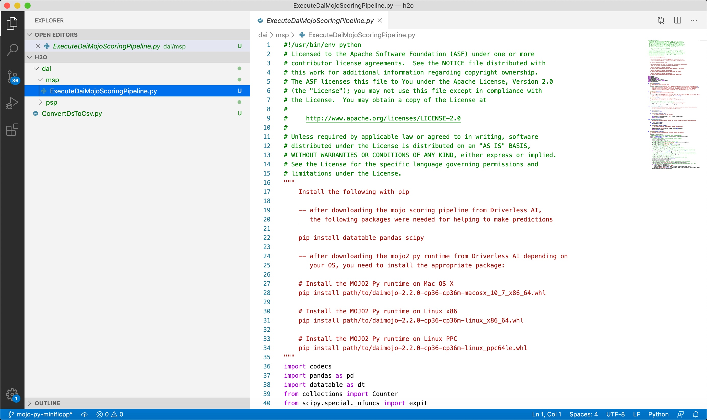

# MiNiFi C++ Py Custom Processor for Running the MOJO in MiNiFi Data Flow

## Cloudera Integration Point for CDF

Integrate the Driverless AI MOJO Scoring Pipeline in C++ Runtime with Python Wrapper into Apache MiNiFi C++ through a Python custom processor. This will be a Cloudera integration point for Cloudera Data Flow (CDF), particularly Cloudera Edge Management (CEM). CEM is powered by one or more Apache MiNiFi C++ agents.

If you are using Driverless AI Python Scoring Pipeline, then read the following document: [Execute the Driverless AI Python Scoring Pipeline within MiNiFi Data Flow](minifi-python-scoring-pipeline.md)

## Video Walkthrough

Here is a link to a YouTube video in case you want to see a video walkthrough of running this deployment example: [MiNiFi Custom Processor for Running the MOJO in MiNiFi Data Flow](https://youtu.be/jQYbZ3TrncM)

## Prerequisites

- Recommended: Launch Ubuntu 18.04 Linux EC2 instance

- Recommended: Create Anaconda or Miniconda Environment

~~~
conda create -n model-deployment python=3.6
conda activate model-deployment
~~~

### MiNiFi C++

- For RHEL/CentOS:

~~~bash
yum install -y epel-release
yum install -y leveldb
~~~

- For Debian/Ubuntu:

~~~bash
apt install -y libleveldb-dev
apt install -y libxml2
~~~

- Download the latest version of MiNiFi C++: https://nifi.apache.org/minifi/download.html

- Set MINIFI_HOME

~~~bash
# For Linux
echo "export MINIFI_HOME=/path/to/nifi-minifi-cpp-0.7.0/" | tee -a ~/.profile

# For Mac OS X
echo "export MINIFI_HOME=/path/to/nifi-minifi-cpp-0.7.0/" | tee -a ~/.bash_profile
~~~

### Driverless AI MOJO

If you have not downloaded the dai-deployment-examples repository, you can do so with the following command:

~~~bash
git clone https://github.com/h2oai/dai-deployment-examples
~~~

- Python Datatable, Pandas, Scipy

~~~bash
pip install datatable
pip install pandas
pip install scipy
~~~

- MOJO2 Py Runtime
    - For Mac OS X `model-deployment/common/mojo2-runtime/cpp-runtime/python-wrapper/mojo2-py-runtime/macos-x/daimojo-2.2.0-cp36-cp36m-macosx_10_7_x86_64.whl`
    - For Linux `model-deployment/common/mojo2-runtime/cpp-runtime/python-wrapper/mojo2-py-runtime/linux/daimojo-2.2.0-cp36-cp36m-linux_x86_64.whl`
    - For IBM PowerPC `model-deployment/common/mojo2-runtime/cpp-runtime/python-wrapper/mojo2-py-runtime/ibm-powerpc/daimojo-2.2.0-cp36-cp36m-linux_ppc64le.whl`

~~~bash
# For Mac OS X
pip install daimojo-2.2.0-cp36-cp36m-macosx_10_7_x86_64.whl

# For Linux
pip install daimojo-2.2.0-cp36-cp36m-linux_x86_64.whl

# For IBM PowerPC
pip install daimojo-2.2.0-cp36-cp36m-linux_ppc64le.whl
~~~

- Recommend Set **DRIVERLESS_AI_LICENSE_KEY** as an environment variable for OS that MiNiFi C++ runs on
    - you will need to get Driverless AI product to get the License Key

~~~bash
# Linux user
echo "export DRIVERLESS_AI_LICENSE_KEY={license_key}" | tee -a ~/.profile

# Mac user
echo "export DRIVERLESS_AI_LICENSE_KEY={license_key}" | tee -a ~/.bash_profile
~~~

- Pipeline MOJO File
    comes with this repo under `model-deployment/common/hydraulic/mojo-pipeline/pipeline.mojo`

- Hydraulic Sensor Test Data Set
    - comes with this repo under `model-deployment/common/hydraulic/testData/`

## Process for Developing the MiNiFi C++ Py Processor

Note: This section explains how the processor was built, feel free to go to the next section if you want to run the example.

For developing the MiNiFi C++ Python processor, I used Visual Studio Code. On the nifi-minifi-cpp repo, I read the page called "**Apache NiFi - MiNiFi - Python Processors Readme**", which explains how to write the MiNiFi C++ Python custom processor. I also referenced a few  MiNiFi C++ Python custom processor examples: [ExampleProcessor.py](https://github.com/apache/nifi-minifi-cpp/blob/master/extensions/script/ExampleProcessor.py) and [SentimentAnalysis.py](https://github.com/apache/nifi-minifi-cpp/blob/master/extensions/pythonprocessors/examples/SentimentAnalysis.py). 

I also familiarized myself with executing the MOJO Scoring Pipeline in C++ Runtime with the Python Wrapper through reading and practicing the examples in the H2O [Driverless AI MOJO Scoring Pipeline - C++ Runtime with Python and R Wrappers](http://docs.h2o.ai/driverless-ai/1-8-lts/docs/userguide/scoring-pipeline-cpp.html) documentation.

When I was writing the code for the MiNiFi C++ Python processor [ExecuteDaiMojoScoringPipeline.py](model-deployment/apps/nifi-minifi-cpp/minifi-python/h2o/dai/msp/ExecuteDaiMojoScoringPipeline.py), I made sure to install module dependencies using pip, so I could use H2O's MOJO2 Py Runtime and Python Datatable. For example, I ran commands `pip install datatable` and `pip install daimojo-2.2.0-cp36-cp36m-linux_x86_64.whl`. You'll notice when you download the daimojo module from Driverless AI, there is a version for mac os x, linux and IBM power pc, I installed the version for linux since I was using linux.

If you want to add or update Python code for the MiNiFi C++ Python processor, you can open your favorite IDE, then import the project. I will walk you through the brief steps to open the project in Visual Studio Code:

~~~bash
cd your/path/to/dai-deployment-examples/mojo-py-minificpp/model-deployment/apps/nifi-minifi-cpp/minifi-python/h2o/

# Open the h2o python processors in Visual Studio Code
code .
~~~

**Figure 1:** MiNiFi C++ Python processor "ExecuteDaiMojoScoringPipeline.py"

Next I needed to write the Python processor and make sure it was added to the MiNiFi product.

Note: the steps moving forward will assume you are running Ubuntu 18.04.

## Add MiNiFi C++ Py Custom Processor to MiNiFi product

If you have not already downloaded the latest version of MiNiFi C++, then download it. MiNiFi C++ is configured by default to read `minifi-python` directory for any python processors. First we will create an `h2o/dai/msp` folder path in `minifi-python` directory:

~~~bash
# go into nifi-minifi-cpp minifi-python/ folder
cd /home/ubuntu/nifi-minifi-cpp-0.7.0/minifi-python/

# create h2o/dai/msp folder path
mkdir -p h2o/dai/msp/
~~~

First we need to copy over **ConvertDsToCsv.py** to `h2o/` folder.

~~~bash
# go to h2o folder
cd h2o

# copy ConvertDsToCsv.py to current folder
cp /home/ubuntu/dai-deployment-examples/mojo-py-minificpp/model-deployment/apps/nifi-minifi-cpp/minifi-python/h2o/ConvertDsToCsv.py .
~~~

Then we copy ExecuteDaiMojoScoringPipeline.py to `h2o/dai/msp/` folder.

~~~bash
# go into msp (mojo scoring pipeline) folder
cd dai/msp/

# copy ExecuteDaiMojoScoringPipeline.py to current folder
cp /home/ubuntu/dai-deployment-examples/mojo-py-minificpp/model-deployment/apps/nifi-minifi-cpp/minifi-python/h2o/dai/msp/ExecuteDaiMojoScoringPipeline.py .
~~~

Now that both python processors are copied over, we need to tell MiNiFi C++ where to find them. So we will overwrite the current `minifi.properties` file with our version of it.

~~~bash
# go into nifi-minifi-cpp conf/ folder
cd /home/ubuntu/nifi-minifi-cpp-0.7.0/conf/

# copy our version of minifi.properties over to conf/ to overwrite the current one
cp /home/ubuntu/dai-deployment-examples/mojo-py-minificpp/model-deployment/apps/nifi-minifi-cpp/conf/minifi.properties .
~~~

We will start MiNiFi C++ after we create the MiNiFi flow through writing a `config.yml` file.

## Build a MiNiFi Flow to do Real-Time & Batch Scoring

You could build a MiNiFi C++ flow from scratch with the custom processor **ExecuteDaiMojoScoringPipeline** to do interactive scoring or batch scoring.

To make it easier to see how to run the MOJO in the MiNiFi flow, I have created two MiNiFi flow config files: one can do interactive (real-time) scoring and the other one can do batch scoring. It just depends on the data you are ingesting into the flow. If you ingest tabular data that has only 1 row of data in each file, then the **ExecuteDaiMojoScoringPipeline** will do real-time scoring. If you ingest tabular data that has multiple rows of data in each file, then the **ExecuteDaiMojoScoringPipeline** will do batch scoring.

Here are the two MiNiFi flow config files:

- MiNiFi Flow Config for batch scoring: [config-msp-batch-scoring.yml](model-deployment/apps/nifi-minifi-cpp/conf/config-msp-batch-scoring.yml)
- MiNiFi Flow Config for real-time scoring: [config-msp-interactive-scoring.yml](model-deployment/apps/nifi-minifi-cpp/conf/config-msp-interactive-scoring.yml)

## Import MiNiFi Flow Config into MiNiFi C++

In the MiNiFi `conf/`, there is a pre-existing `config.yml`. We can replace it with our config file for either batch scoring or interactive scoring. For MiNiFi to recognize the config file, we must rename our chosen config file to `config.yml`. We will walk through how to replace it with our config file for interactive scoring:

~~~bash
# go into nifi-minifi-cpp conf/ folder
cd /home/ubuntu/nifi-minifi-cpp-0.7.0/conf/

# copy our minifi flow config file for interactive scoring to conf/
cp /home/ubuntu/dai-deployment-examples/mojo-py-minificpp/model-deployment/apps/nifi-minifi-cpp/conf/config-msp-interactive-scoring.yml .

# overwrite the pre-existing config.yml with our config that does interactive scoring
mv config-msp-interactive-scoring.yml config.yml
~~~

Then we can start MiNiFi C++:

~~~bash
# go back to nifi-minifi-cpp base folder
cd ../

# start minifi C++
./bin/minifi.sh start
~~~

**Note:** with Cloudera Edge Management (CEM), we can build MiNiFi flows in a visual canvas similar to how we do for NiFi.

## MiNiFi Run MOJO Real-Time Scores

Here we look at the file that the PutFile processor wrote to the local file system, which contains the real-time score result for when MiNiFi C++ executed the MOJO on some real-time data (one row of data) to do real-time scoring.

Note: PutFile stores the files with real-time predictions in the following folder path and creates the path if it doesn't exist: `home/ubuntu/dai-deployment-examples/mojo-py-minificpp/model-deployment/common/hydraulic/predData/pred-real-time-data`

## MiNiFi Run MOJO Batch Scores

Here we look at the file that the PutFile processor wrote to the local file system, which contains the batch score result for when MiNiFi C++ executed the MOJO on some batch data (multiple rows of data) to do batch scoring.

Note: PutFile stores the files with batch predictions in the following folder path and creates the path if it doesn't exist: `home/ubuntu/dai-deployment-examples/mojo-py-minificpp/model-deployment/common/hydraulic/predData/pred-batch-data`